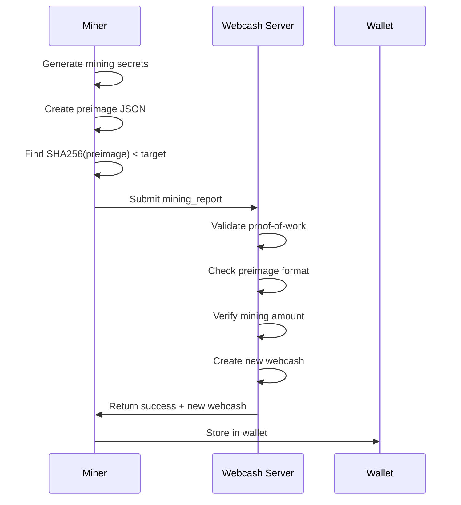
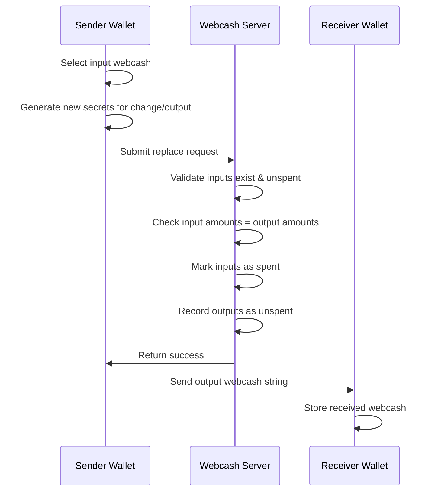
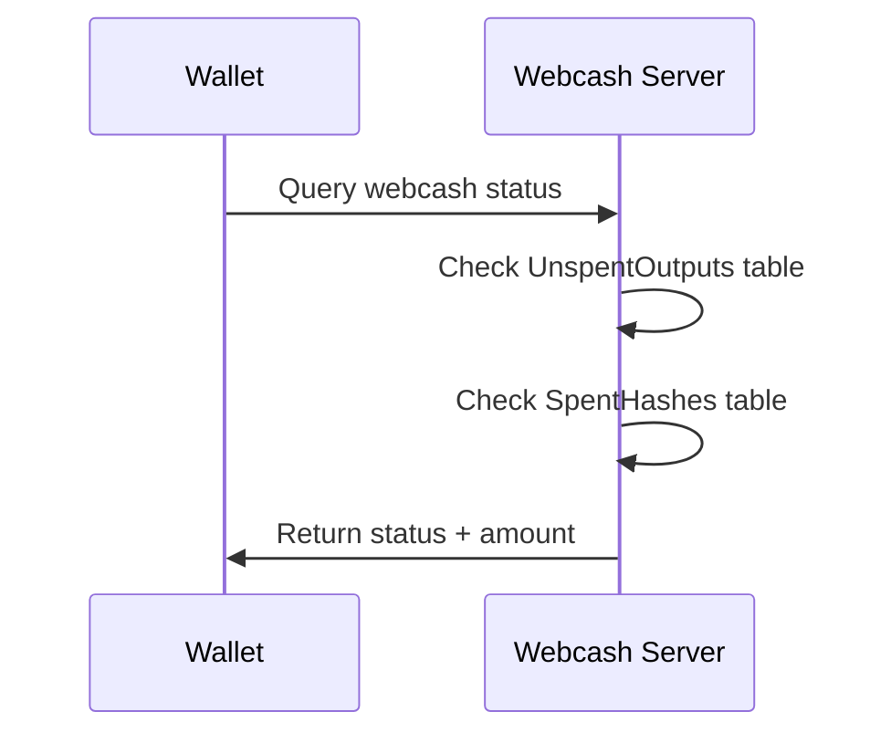

# Webcash System Architecture

## 📋 **CRITICAL CORRECTION NOTICE**

> **🚨 IMPORTANT**: This document has been corrected to accurately reflect the **centralized** nature of the Webcash system. Previous versions contained incorrect information about decentralization.

## 🎯 **System Overview**

Webcash is a **centralized electronic cash system** operated by Webcash LLC, a Wyoming Limited Liability Company. Unlike decentralized cryptocurrencies, Webcash operates more like a traditional banking system where:

- **Webcash LLC** runs the authoritative server
- **No account balances** are stored (only transaction validation)
- **Miners create new webcash** through proof-of-work
- **Server validates** all transactions and mining
- **Central bank-like control** over monetary supply

## 🏛️ **Core Architecture Components**

### **1. Webcash LLC Server (Central Authority)**
```
┌─────────────────────────────────────────────────────────────┐
│                    WEBCASH LLC SERVER                       │
│  ┌─────────────────────────────────────────────────────┐    │
│  │ PostgreSQL Database                               │    │
│  │ ├─ MiningReports (PoW validation)               │    │
│  │ ├─ Replacements (transaction validation)        │    │
│  │ ├─ Burns (supply reduction)                     │    │
│  │ └─ UnspentOutputs (double-spend prevention)     │    │
│  └─────────────────────────────────────────────────────┘    │
│                                                             │
│  API Endpoints:                                             │
│  ├─ /api/v1/mining_report (validate PoW, create webcash)   │
│  ├─ /api/v1/replace (validate transactions)                 │
│  ├─ /api/v1/health_check (check spent status)               │
│  ├─ /api/v1/target (get mining parameters)                  │
│  └─ /api/v1/burn (destroy webcash)                          │
└─────────────────────────────────────────────────────────────┘
```

**Key Functions:**
- **Mining Validation**: Accepts proof-of-work, creates new webcash
- **Transaction Validation**: Validates webcash replacements (spending)
- **Double-Spend Prevention**: Tracks spent webcash hashes
- **Supply Control**: Enforces mining schedule and halving
- **No Balance Storage**: Only validates transactions, doesn't store balances

### **2. Wallet Clients (Python, C++, Rust)**
```
┌─────────────────────────────────────────────────────────────┐
│                    WALLET CLIENT                            │
│  ┌─────────────────────────────────────────────────────┐    │
│  │ SQLite Database                                   │    │
│  │ ├─ webcash (owned secrets)                       │    │
│  │ ├─ unconfirmed (pending transactions)            │    │
│  │ ├─ log (transaction history)                     │    │
│  │ └─ master_secret (HD wallet seed)                │    │
│  └─────────────────────────────────────────────────────┘    │
│                                                             │
│  Operations:                                                │
│  ├─ setup (accept terms)                                    │
│  ├─ insert (receive webcash)                                │
│  ├─ pay (send webcash)                                      │
│  ├─ check (verify ownership)                                │
│  ├─ recover (restore from seed)                             │
│  └─ mine (create new webcash)                               │
└─────────────────────────────────────────────────────────────┘
```

### **3. Mining Process**
```
┌─────────────┐    ┌─────────────────┐    ┌─────────────────┐
│   MINER     │───▶│  PROOF-OF-WORK │───▶│ WEBCASH SERVER │
│             │    │                 │    │                 │
│ 1. Generate │    │ SHA256(preimage)│    │ 3. Validate PoW │
│    secrets  │    │ < target        │    │    ✓ Accept     │
│             │    │                 │    │    ✓ Create     │
└─────────────┘    └─────────────────┘    │    ✓ Return     │
                                          │      webcash    │
                                          └─────────────────┘
```

## 🔄 **Transaction Flow**

### **1. Mining (Creating New Webcash)**


### **2. Payment (Replacing Webcash)**


### **3. Verification (Health Check)**


## 🏦 **Central Bank Economics**

### **Monetary Policy Control**
- **Supply Schedule**: Fixed mining rewards that halve every epoch
- **Total Supply**: Controlled by Webcash LLC mining parameters
- **Inflation Control**: Mining rewards decrease over time
- **No Voting**: Webcash LLC sets policy unilaterally

### **Current Economics (2025)**
```rust
// Mining parameters (controlled by Webcash LLC)
const INITIAL_MINING_AMOUNT: u64 = 200_000_000_000_000; // 200M webcash
const INITIAL_SUBSIDY_AMOUNT: u64 = 10_000_000_000_000;  // 10M webcash
const REPORTS_PER_EPOCH: u64 = 525_000;                  // ~6 months
const TARGET_INTERVAL: Duration = Duration::seconds(10); // 10 second blocks

// Epoch calculation
fn get_epoch(num_reports: u64) -> u64 {
    num_reports / REPORTS_PER_EPOCH
}

// Mining reward for current epoch
fn get_mining_amount(epoch: u64) -> u64 {
    INITIAL_MINING_AMOUNT >> epoch.min(63)
}
```

### **Trust Model**
```
┌─────────────────────────────────────────────────────────────┐
│                    TRUST MODEL                              │
├─────────────────────────────────────────────────────────────┤
│ Users trust Webcash LLC to:                                │
│ ✓ Operate server honestly                                  │
│ ✓ Validate transactions correctly                          │
│ ✓ Not double-spend or counterfeit                          │
│ ✓ Maintain service availability                            │
│ ✓ Comply with US financial regulations                     │
├─────────────────────────────────────────────────────────────┤
│ Unlike decentralized systems:                              │
│ ✗ No censorship resistance                                 │
│ ✗ No algorithmic monetary policy                          │
│ ✗ Single point of failure                                  │
│ ✗ Subject to legal jurisdiction                            │
└─────────────────────────────────────────────────────────────┘
```

## 🔐 **Security Model**

### **Server Security (Webcash LLC Responsibility)**
- **Transaction Validation**: Prevent double-spending
- **Mining Validation**: Verify proof-of-work
- **Data Integrity**: Maintain accurate spent/unspent records
- **Service Availability**: Keep server operational
- **Legal Compliance**: Follow US financial regulations

### **Client Security (Wallet Responsibility)**
- **Secret Storage**: Protect private keys and secrets
- **Transaction Validation**: Verify server responses
- **Input Sanitization**: Validate all user inputs
- **Memory Safety**: Prevent information leakage

### **Cryptographic Security**
- **SHA256**: For proof-of-work and secret commitments
- **Secure Random**: For secret generation
- **Zero Knowledge**: Public webcash reveals no secret information
- **Deterministic Wallets**: Recoverable from master secret

## 📊 **Data Structures**

### **SecretWebcash (Wallet Storage)**
```rust
struct SecretWebcash {
    secret: SecureString,  // 32-byte hex secret
    amount: Amount,        // 8-decimal precision amount
}
```

**Serialization Format:**
```
e{amount}:{type}:{secret}
Example: e1.50000000:secret:abcdef1234567890abcdef1234567890abcdef1234567890abcdef1234567890
```

### **PublicWebcash (Verification)**
```rust
struct PublicWebcash {
    hash: [u8; 32],  // SHA256(secret)
    amount: Amount,  // Same amount as secret
}
```

**Serialization Format:**
```
e{amount}:{type}:{hash}
Example: e1.50000000:public:1234567890abcdef1234567890abcdef1234567890abcdef1234567890abcdef
```

### **Mining Report (Server Communication)**
```json
{
  "preimage": "base64-encoded JSON with webcash data",
  "work": "SHA256 hash of preimage",
  "legalese": {
    "terms": true
  }
}
```

## 🚀 **API Endpoints**

### **Mining Report Submission**
```http
POST /api/v1/mining_report
Content-Type: application/json

{
  "preimage": "eyJ3ZWJjYXNoIjpb...]",
  "work": "0000000000000000...",
  "legalese": {"terms": true}
}
```

**Response:**
```json
{
  "status": "success",
  "difficulty_target": 28
}
```

### **Transaction Replacement**
```http
POST /api/v1/replace
Content-Type: application/json

{
  "webcashes": ["e1.00000000:secret:..."],
  "new_webcashes": ["e1.00000000:secret:..."],
  "legalese": {"terms": true}
}
```

**Response:**
```json
{"status": "success"}
```

### **Health Check**
```http
POST /api/v1/health_check
Content-Type: application/json

["e1.00000000:public:..."]
```

**Response:**
```json
{
  "status": "success",
  "results": {
    "e1.00000000:public:...": {
      "spent": false,
      "amount": "1.00000000"
    }
  }
}
```

## 🗄️ **Database Schema**

### **Server Database (PostgreSQL)**
```sql
-- Mining validation records
CREATE TABLE MiningReports (
    id BIGSERIAL PRIMARY KEY,
    received BIGINT NOT NULL,
    preimage TEXT UNIQUE NOT NULL,
    difficulty SMALLINT NOT NULL,
    next_difficulty SMALLINT NOT NULL,
    aggregate_work DOUBLE PRECISION NOT NULL
);

-- Transaction validation records
CREATE TABLE Replacements (
    id BIGSERIAL PRIMARY KEY,
    received BIGINT NOT NULL
);

-- Transaction inputs (many-to-one with Replacements)
CREATE TABLE ReplacementInputs (
    id BIGSERIAL PRIMARY KEY,
    replacement_id BIGINT NOT NULL,
    hash BYTEA NOT NULL,
    amount BIGINT NOT NULL,
    FOREIGN KEY (replacement_id) REFERENCES Replacements(id)
);

-- Transaction outputs (many-to-one with Replacements)
CREATE TABLE ReplacementOutputs (
    id BIGSERIAL PRIMARY KEY,
    replacement_id BIGINT NOT NULL,
    hash BYTEA NOT NULL,
    amount BIGINT NOT NULL,
    FOREIGN KEY (replacement_id) REFERENCES Replacements(id)
);

-- Burn records
CREATE TABLE Burns (...);

-- Double-spend prevention
CREATE TABLE UnspentOutputs (
    id BIGSERIAL PRIMARY KEY,
    hash BYTEA UNIQUE NOT NULL,
    amount BIGINT NOT NULL
);

-- Spent webcash tracking
CREATE TABLE SpentHashes (
    id BIGSERIAL PRIMARY KEY,
    hash BYTEA UNIQUE NOT NULL
);
```

### **Wallet Database (SQLite)**
```sql
-- Owned webcash secrets
CREATE TABLE webcash (
    id INTEGER PRIMARY KEY,
    secret TEXT NOT NULL,
    amount TEXT NOT NULL,
    created_at INTEGER NOT NULL
);

-- Pending transactions
CREATE TABLE unconfirmed (
    id INTEGER PRIMARY KEY,
    data TEXT NOT NULL,
    created_at INTEGER NOT NULL
);

-- Transaction log
CREATE TABLE log (
    id INTEGER PRIMARY KEY,
    type TEXT NOT NULL,
    memo TEXT,
    amount TEXT,
    timestamp INTEGER NOT NULL
);

-- HD wallet metadata
CREATE TABLE metadata (
    key TEXT PRIMARY KEY,
    value TEXT NOT NULL
);
```

## 🔄 **Operational Flow**

### **Normal Operation**
1. **User Setup**: Accept terms, generate master secret
2. **Receive Webcash**: Insert received secrets into wallet
3. **Send Webcash**: Replace owned secrets with new ones
4. **Verify Ownership**: Health check before spending
5. **Backup**: Secure master secret for recovery

### **Mining Operation**
1. **Get Target**: Query current mining parameters
2. **Generate Secrets**: Create mining webcash
3. **Find Proof**: SHA256(preimage) < target
4. **Submit Report**: Send to server for validation
5. **Receive Reward**: Get newly created webcash
6. **Secure Storage**: Replace mining secrets with secure ones

### **Recovery Process**
1. **Master Secret**: Restore from backup
2. **Regenerate Secrets**: Deterministic HD derivation
3. **Health Check**: Verify which secrets still own webcash
4. **Reconstruct Wallet**: Import valid webcash

## ⚖️ **Legal & Compliance**

### **Regulatory Framework**
- **Wyoming LLC**: Webcash LLC incorporated in Wyoming
- **US Jurisdiction**: Subject to US financial regulations
- **KYC/AML**: May be required depending on use case
- **Consumer Protection**: Standard consumer protection laws apply

### **User Responsibilities**
- **Secure Storage**: Protect master secrets and backups
- **Legal Compliance**: Follow applicable laws and regulations
- **Terms Acceptance**: Agree to Webcash LLC terms of service
- **Due Diligence**: Understand centralized trust model

## 🎯 **Key Differences from Decentralized Systems**

| Aspect | Webcash (Centralized) | Bitcoin (Decentralized) |
|--------|----------------------|------------------------|
| **Governance** | Webcash LLC (central bank) | Algorithmic (consensus) |
| **Supply Control** | Webcash LLC discretion | Fixed algorithm |
| **Censorship Resistance** | None | High |
| **Trust Model** | Trust Webcash LLC | Trust mathematics |
| **Legal Compliance** | Required | Optional |
| **Transaction Speed** | Instant | 10-60 minutes |
| **Fees** | Zero | Variable (miner fees) |
| **Finality** | Instant | Probabilistic |

## 🚀 **Development Roadmap**

### **Phase 1: Foundation** ✅
- Core data types and cryptography
- Basic wallet operations
- Server communication framework

### **Phase 2: Full Compatibility** 🚧
- Complete Python/C++ API compatibility
- Full wallet functionality
- Mining integration

### **Phase 3: Enhanced Security** 📋
- Advanced cryptographic features
- Hardware wallet support
- Multi-signature capabilities

### **Phase 4: Performance & Scale** 📋
- Optimized algorithms
- Batch operations
- Memory-efficient data structures

### **Phase 5: Production Ready** 📋
- Comprehensive testing
- Security audit
- crates.io publication

---

**📖 For implementation details, see [IMPLEMENTATION_STATUS.md](../IMPLEMENTATION_STATUS.md)**
